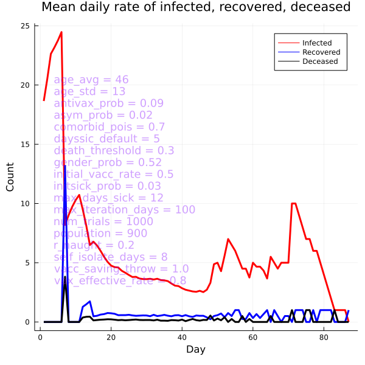
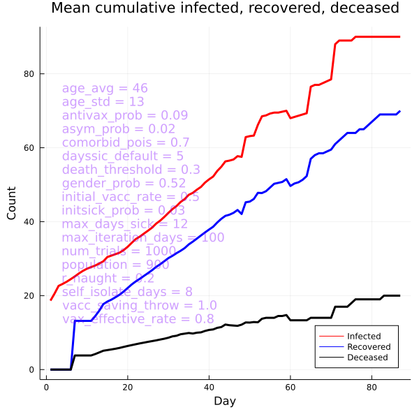
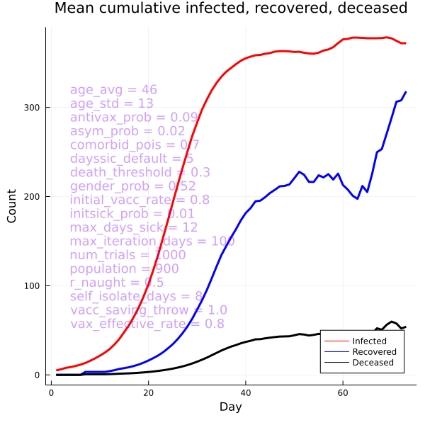

# A Julia language implementation of a simulation of infectious disease spread

## About

This is a Julia project that simulates the spread of an infection throughout a population. The simulation allows for numerous parameters when running the simulation such as the age (modeled using a normal distribution by specifying a mean and standard deviation), the number of comorbidities of each subject in the population (modeled using a Poisson distribution), the initial rate of infected individuals, the inital rate of vaccination, etc. The simulation can be run for some chosen number of trials, as well as a chosen maximum number of days per trial.

After running the simulation, a CSV file is produced indicating the daily numbers for infected, recovered, deceased, as well as their cumulative amounts, recording one row for each day that the simulation ran for that particular trial. The data will also be plotted on charts for daily and cummulative numbers.

## Parameters

| PARAMETER          | SHORT FORM PARAMETER | DESCRIPTION                                                                                                                                                                        |
|--------------------|----------------------|------------------------------------------------------------------------------------------------------------------------------------------------------------------------------------|
| age_avg            | a                    | To generate normal distribution centered on this mean age                                                                                                                          |
| age_std            | s                    | To generate normal distribution with this standard deviation                                                                                                                       |
| antivax_prob       | x                    | The percentage of anti-vax in the population (0.0 - 1.0) who will not vaccinate                                                                                                    |
| asym_prob          | y                    | The percentage of people in the population who do not exhibit symptoms and will not self isolate                                                                                   |
| comorbid_pois      | c                    | A value between 0.0 and 1.0 used to generate the number of comorbidities, affect the rate of death                                                                                 |
| dayssic_default    | d                    | For those people who are sick at the start of the simulation, how many days they have been sick                                                                                    |
| death_threshold    | o                    | The number above which a person when "rolling the die" for a uniform distribution, will succumb and die from the infection                                                         |
| gender_prob        | g                    | The probability that the subject in the population is male (currently not used to calculate infection, recovery, or death rate)                                                    |
| initial_vacc_rate  | v                    | The percentage (expressed as 0.0 - 1.0) of people in the population already vaccinated                                                                                             |
| initsick_prob      | k                    | The percentage (expressed as 0.0 - 1.0) of people in the population who start the simulation already infected                                                                      |
| max_days_sick      | m                    | The number of days a person who becomes infected remains sick (and infectious)                                                                                                     |
| max_iteration_days | i                    | The maximum number of days a simulation will run per given trial, even if there are people who can still become infected                                                           |
| num_trials         | t                    | The total number of trials in the entire simulation                                                                                                                                |
| population         | p                    | The size of the population in the simulation                                                                                                                                       |
| r_naught           | z                    | The rate at which people who are infectious infect others in the population (not exactly the traditional R0 used in infectious disease studies)                                    |
| self_isolate_days  | l                    | The number of days after which a person will self-isolate once infected, thus not passing the infection to others                                                                  |
| vacc_saving_throw  | w                    | If vaccinated, a person will not succumb to the infection of "rolling the die" for a uniform distribution below this value. A value of 1.0 will always result in a "saving throw". |
| vax_effective_rate | e                    | The percentage of people who despite being vaccinated, will still be subject to acquiring the infection due to some failure in the vaccination.                                    |

## Running

The program can be run with default values for all parameters, simply by executing the Julia interpreter with the name of the script, i.e.

`julia infection_simulation.jl`

(assuming the julia interpreter is on your path, and the command window in which you are running has the folder that contains the )

Running without any overrides for the parameter values would entail using the following defaults:

--age_avg 46  
--age_std 13  
--antivax_prob 0.09  
--asym_prob 0.02  
--comorbid_pois 0.7  
--dayssic_default 5  
--death_threshold 0.3  
--gender_prob 0.52  
--initial_vacc_rate 0.5  
--initsick_prob 0.1  
--max_days_sick 12  
--max_iteration_days 50  
--num_trials 1000  
--population 900  
--r_naught 0.1  
--self_isolate_days 8  
--vacc_saving_throw 1.0  
--vax_effective_rate 0.8

To change any of the parameters from their default, specify a different value for the parameter. For example, if you wanted to start with a higher R0 from the default but a lower rate of initial vaccination, you might use:

`julia infection_simulation.jl --r_naught 0.2 --initial_vacc_rate 0.3 --vax_effective_rate 0.9`

representing an upper bound of 20% probability of any infectious individual infecting some other susceptible individual in the population (where susceptible = a person who either did not take the vaccine or whose vaccine was not effective, and has not yet been infected in the past thereby gaining natural immunity), and a population rate of vaccination = 30% in which 90% of the vaccines worked.

The following using the short form for the parameter represents the identical parameter values as above:

`julia infection_simulation.jl -z 0.2 -v 0.3 -e 0.9`

## Trial results

### Trial 1

Running the command with the following parameters

`julia infection_simulation.jl --max_iteration_days 100 --r_naught 0.2 --initsick_prob 0.03`

produces the following charts:

The corresponding data can be viewed in the [CSV file](./output/trials_20220906_223036.csv)

### Trial 2

Running the command with the following parameters

`julia infection_simulation.jl --max_iteration_days 100 --r_naught 0.5 --initsick_prob 0.01 --initial_vacc_rate 0.8`

produces the following charts:

The corresponding data can be viewed in the [CSV file](./output/trials_20220906_223735.csv)